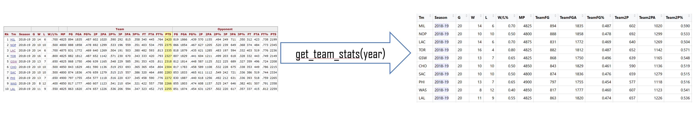
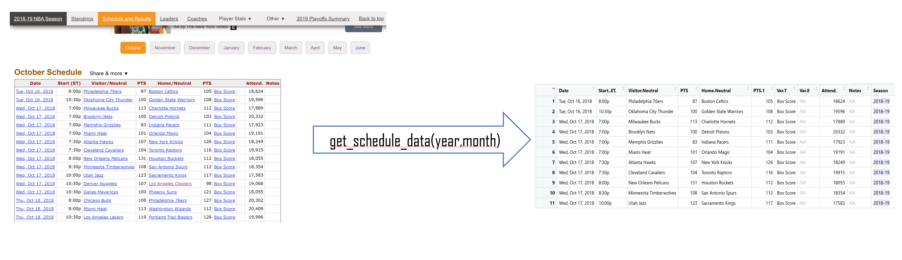

## Data Source
[Basketball Reference](https://www.basketball-reference.com/)

## Difficulty
- No "well-prepared" datasets
- Multiple data sources within the website
- Need to scrape data from websites

## Team Stats

[2018-19 NBA Team Cumulative Season Games Finder](https://www.basketball-reference.com/play-index/tgl_finder.cgi?request=1&match=single&lg_id=NBA&is_playoffs=N&team_seed_cmp=eq&opp_seed_cmp=eq&year_min=2019&year_max=2019&is_range=Y&game_num_type=team&game_num_min=1&game_num_max=20&order_by=pts)

## Game Stats

[2018-19 NBA Schedule and Results](https://www.basketball-reference.com/leagues/NBA_2019_games.html)

## Secondary Info
- `get_ws_data(year)`: obtain the win share data in specific year
- `get_injury_data(year)` : obtain the severe player injuries, sorted by “cash earned during injury”
- `get_ws_injury_trans_data(year)`: obtain the winshare data considering player injuries and team transfer.
