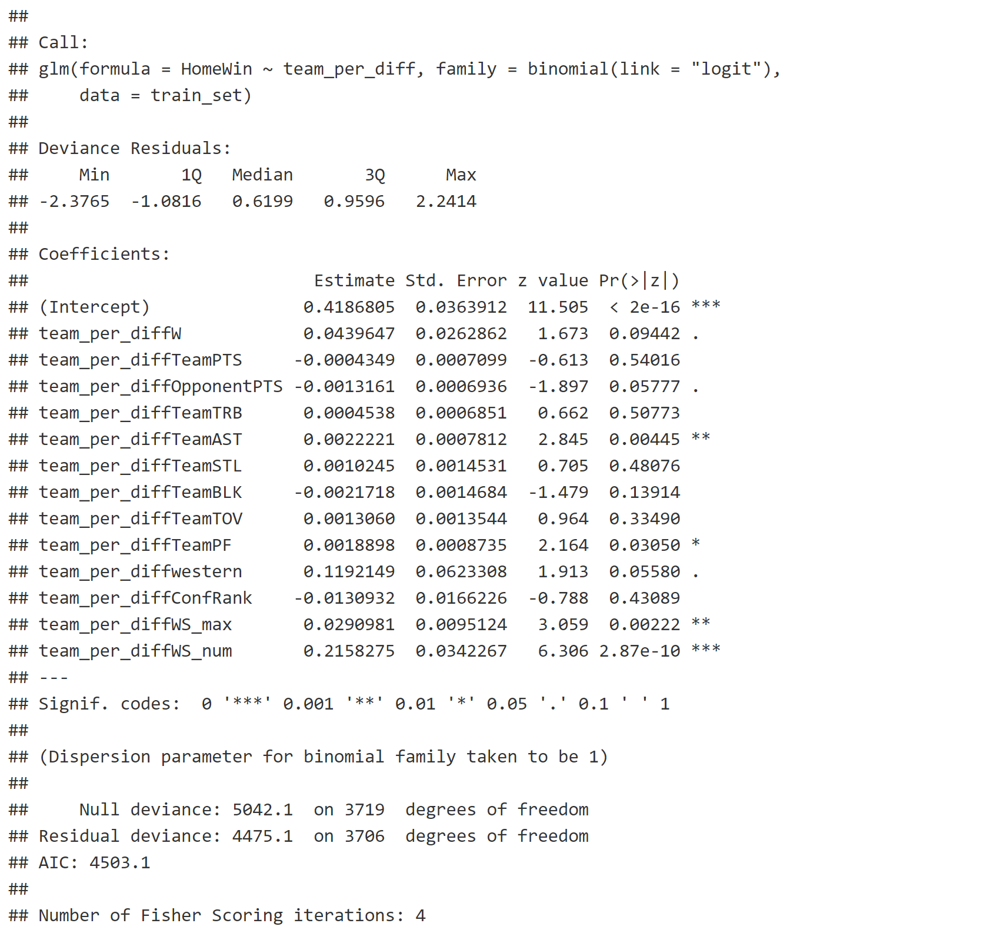
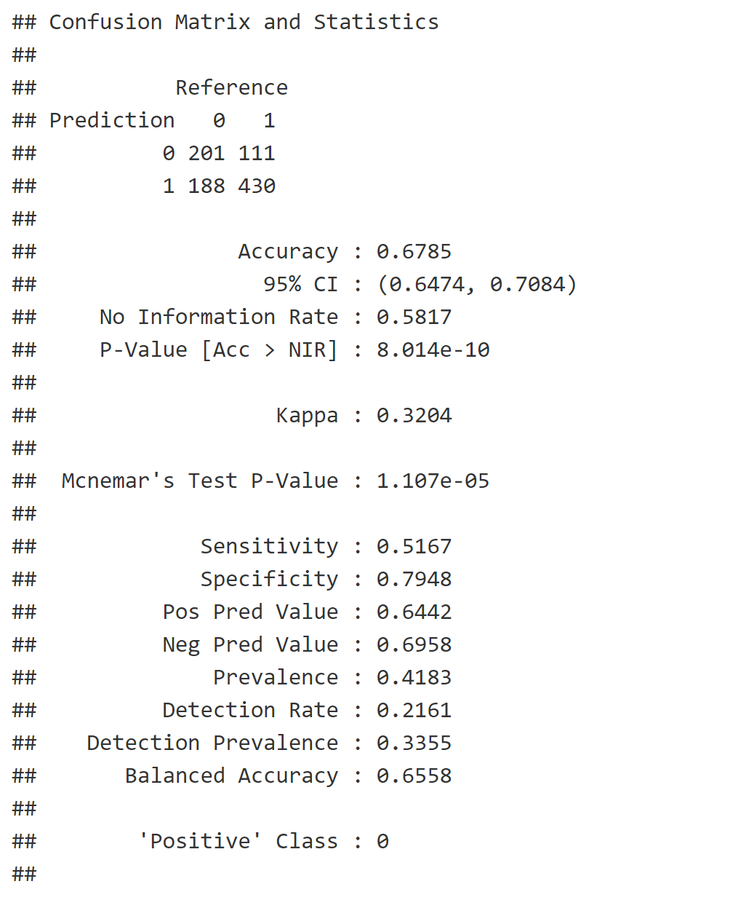

## Why Not Machine Learning Models
- Better Interpretation: infernce and prediction
- Prediction Accuracy: achieve similar performance compared to tree-based ML models
- Time Saving
  - save training time
  - no need for parameter tuning, cross-validation

## Model Formulation

$$ logit[Pr(i \succ j \ \text{in game} \ k)] = (\lambda_i - \lambda_j)^{\top} \beta + \delta \cdot I(i \in adv)+ \gamma^{\top} z_{ij}
$$

where $\lambda_i$ and $\lambda_j$ are the team performance vectors defined based on feature engineering. $I(I \in adv)$ is the indicator for home-court advantage, and $z_{ij}$ are some potential effects not included in the team performance, such as western-eastern effect.  

## Evaluation Metric

Cross-Entropy Loss

$$ \mathcal{L} = - \sum_{i=1}^N y_i log(\hat{p_i})+(1-y_i) log(1-\hat{p_i}) $$

## Prediction Results

	

		<h3>Model Summary</h3>
		
	

	

		<h3>Player-Level: Prediction Accuracy</h3>
		
	

## Model Checking

- Overdispersion: quasi-likelihood approach
